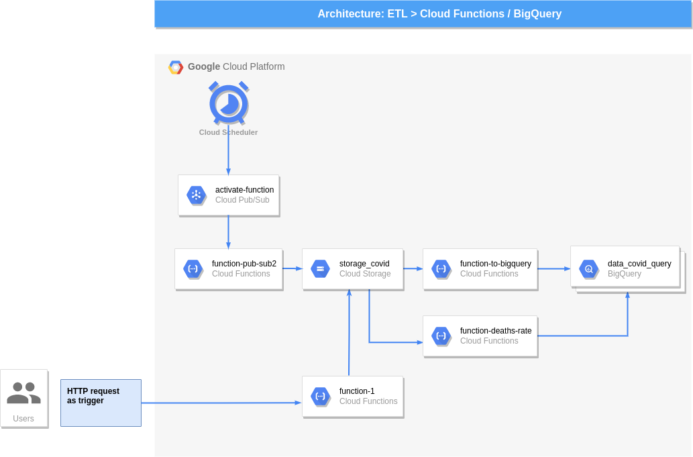

# ETL Covid, Cloud Functions, BigQuery, Cloud Pub/Sub, Cloud Scheduler 

Etl para la transferencia de archivos desde una Api hasta diferentes tablas de BigQuery, en este ejemplo se ilustra dos formas de poner a funcionar este flujo de trabajo:

- Activandolo por medio de una tarea programada desde un Cloud Scheduler y un Cloud Pub/Sub como activador.

- Manualmente por medio de una solicitud HTTP.
